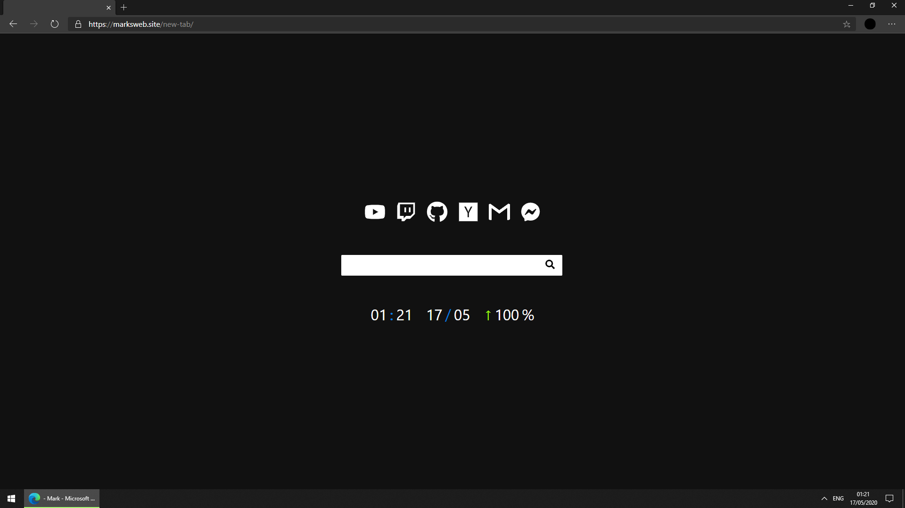

# new-tab

**My personal new tab page for [Edge Dev](https://www.microsoftedgeinsider.com/en-us/download/).**

## Installation

1. `git clone https://github.com/marktiedemann/new-tab`.
2. Install [New Tab Redirect](https://chrome.google.com/webstore/detail/new-tab-redirect/icpgjfneehieebagbmdbhnlpiopdcmna).
3. Set location to `file:///${PWD}/new-tab/index.html`.

## Todos

- Add clock and current date.
- Add weather icons and info.

## License

[Blue Oak](https://blueoakcouncil.org/license/1.0.0)
